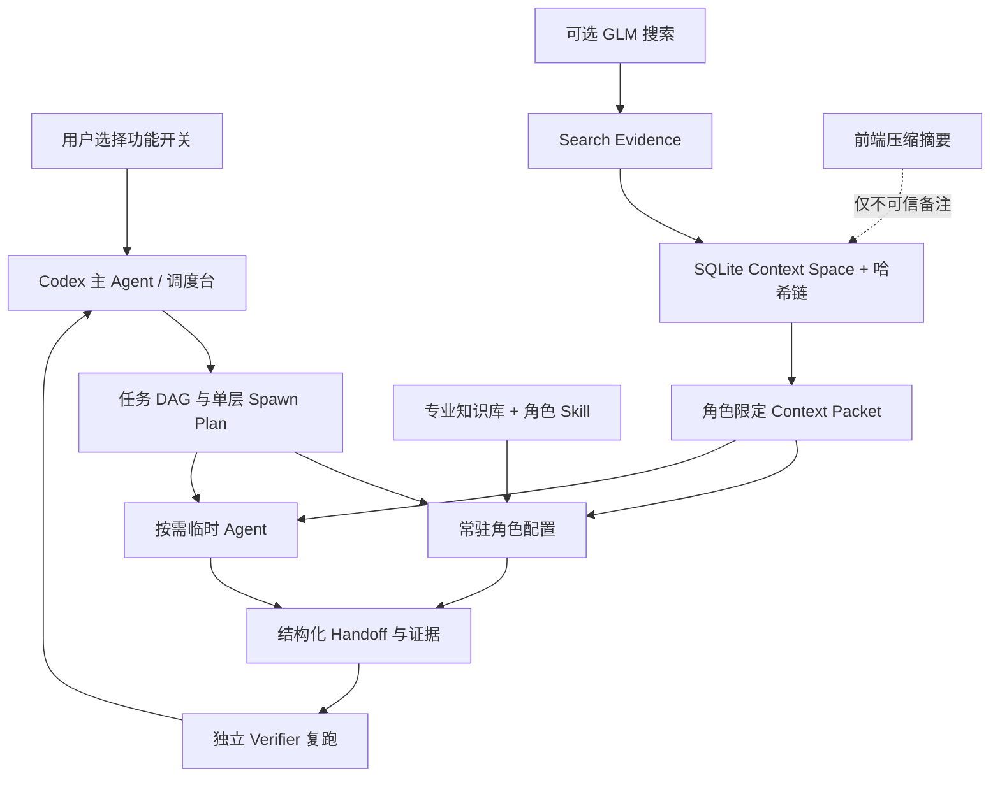

# Codex App Factory V5 控制平面使用指南

> 适用版本：`5.0.0-preview.1`
> 本文描述本地优先控制平面，不把历史报告、Agent 自述或前端压缩摘要当成已验证事实。

## 1. 它解决什么问题

Codex App Factory 的目标不是替代 Codex，而是在复杂项目外增加一层可选择、可审计的工程控制：

1. 用户选择多 Agent 后，由主 Agent 自动拆分任务并调度，不要求用户手工开多个窗口或复制提示词。
2. 固定的常驻角色负责路由、知识、独立验证和漂移检查；实现、测试、研究、集成等工作按需生成临时 Agent。
3. 用独立于前端对话显示的状态数据库和角色 Context Packet 保存可信上下文，避免把前端自动压缩后的摘要误当成事实。
4. 用独立验证、真实命令退出码和物理证据降低“假报告、假通过”。
5. 用来源哈希、角色可见性和 FTS5 管理专业知识，给常驻 Agent 绑定窄职责 Skill。
6. 用户可选择 GLM 联网搜索并自行提供 API Key；未启用或调用失败时不伪造搜索结果。

Factory 默认继承当前 Codex runtime 的模型。它既不把功能锁在 GPT 上，也不把配置中的 `deepseek` 标签当成兼容性证明：使用 GPT 的 Codex 开发者可直接使用；在兼容 Codex runtime 中使用 DeepSeek 的开发者应先运行 `doctor`，再用一个小型真实项目验证模型、工具调用和 Agent 能力。

## 2. 架构与信任边界



Factory 的权威顺序是：

1. 当前仓库中的物理文件和可复跑命令；
2. 验证通过的 Context Packet、运行账本和 Evidence；
3. 用户当前明确确认的需求与决策；
4. Agent 自述、历史报告、前端压缩摘要只能作为待核实线索。

Factory 不能阻止 Codex 前端显示自动压缩，也不会修改 Codex 自身的压缩算法。它通过“不以该摘要为工作依据”降低信息差：`frontend_summary` 会被隔离到 `untrusted_frontend_notes`，不会自动提升为可信上下文。

## 3. 安装

### 3.1 前置条件

- Windows、macOS 或 Linux；本文命令以 PowerShell 为主。
- Node.js 24 或更高版本。V5 使用 Node 内置 `node:sqlite`，没有运行时 npm 依赖。
- Git。
- 支持项目级自定义 Agent 的 Codex 客户端或 CLI。

检查版本：

```powershell
node --version
git --version
```

### 3.2 Windows 推荐安装

获取或解压 Codex App Factory 后，在仓库根目录执行：

```powershell
Set-Location C:\Codex_App_Factory
powershell -ExecutionPolicy Bypass -File .\packages\factory-cli\install.ps1
factoryctl --help
```

安装脚本会检查 Node.js 版本，然后运行 `npm install`、`npm run build` 和 `npm link`。如果目标项目已经存在，可一条命令完成安装与初始化：

```powershell
powershell -ExecutionPolicy Bypass -File .\packages\factory-cli\install.ps1 `
  -ProjectRoot C:\Projects\my-app `
  -MultiAgent `
  -Search none `
  -MaxThreads 4

factoryctl doctor --project C:\Projects\my-app --json
```

参数边界：

- 不传 `-MultiAgent` 时，多 Agent 保持关闭；
- 独立上下文默认开启，明确传 `-NoExternalContext` 才关闭；
- `-Search` 只接受 `none` 或 `glm`，不会接收 API Key；
- `-MaxThreads` 只接受 2–8；
- `-ProjectRoot` 必须是已存在的目录。

### 3.3 手动/跨平台安装

在 CLI 包目录执行：

```powershell
Set-Location C:\Codex_App_Factory\packages\factory-cli
npm install
npm run typecheck
npm test
npm run build
```

排障或不希望创建本机 npm 链接时，直接用源码入口：

```powershell
npm run cli -- --help
```

需要手动创建 `factoryctl` 命令链接时：

```powershell
npm link
factoryctl --help
```

Windows 推荐脚本已经执行 `npm link`，不要重复执行。如果选择不使用链接，本文后续的 `factoryctl ...` 都可替换为：

```powershell
npm run cli -- ...
```

## 4. 初始化项目

### 4.1 推荐配置

下面的配置适合多数复杂项目：启用独立上下文和多 Agent，不启用外部搜索，主 Agent 加三个工作槽位（`max-threads=4` 包含主线程）。

```powershell
factoryctl init `
  --project C:\Projects\my-app `
  --multi-agent `
  --external-context `
  --search none `
  --max-threads 4

factoryctl doctor --project C:\Projects\my-app --json
```

如果项目简单或只希望使用上下文保护：

```powershell
factoryctl init `
  --project C:\Projects\my-app `
  --no-multi-agent `
  --external-context `
  --search none
```

如果希望从第一天使用 GLM：

```powershell
factoryctl init `
  --project C:\Projects\my-app `
  --multi-agent `
  --external-context `
  --search glm `
  --max-threads 4
```

此命令只启用 provider，不接收、不打印 API Key。Key 的提供方式见第 8 节。

### 4.2 初始化会管理什么

目标项目中的 V5 状态以 `.codex-factory/` 为边界，包括配置、Context Space、运行账本、Context Packet 和本地 secrets 文件。安装器还可能在项目级 Codex 配置中增加受标记管理的 Agent/profile 和触发规则。

安全约束：

- 只修改 Factory 明确标记的 managed block；
- 不把用户自己的 `AGENTS.md`、`.codex/config.toml` 或自定义 Agent 整体替换掉；
- `.codex-factory/secrets.env`、SQLite 状态和运行临时文件必须被 Git 忽略；
- 初始化后以 `doctor` 结果确认实际安装状态，不以“命令运行过”作为成功证明。

## 5. 功能开关

| 功能 | 初始化参数 | 后续配置 | 默认建议 |
| --- | --- | --- | --- |
| 原生多 Agent | `--multi-agent` / `--no-multi-agent` | `configure` 使用相同参数 | 复杂项目开启，小任务关闭 |
| 独立上下文 | `--external-context` / `--no-external-context` | `configure` 使用相同参数 | 开启 |
| 外部搜索 | `--search glm` / `--search none` | `configure` 使用相同参数 | 按需开启 |
| 并发上限 | `--max-threads N` | `configure --max-threads N` | 4，按机器和任务调整 |

示例：

```powershell
factoryctl configure --project C:\Projects\my-app --no-multi-agent
factoryctl configure --project C:\Projects\my-app --multi-agent --max-threads 4
factoryctl configure --project C:\Projects\my-app --search none
factoryctl doctor --project C:\Projects\my-app --json
```

多 Agent 和联网搜索都是 opt-in。独立上下文也可关闭，但这样会失去 Context Packet、账本哈希链和压缩摘要隔离，不建议在复杂、跨轮次任务中关闭。

## 6. 自动多 Agent

### 6.1 用户实际体验

用户完成 `init --multi-agent` 后，只需在 Codex 中正常提出任务。主 Agent 根据项目规则自动执行：

1. 判断是否值得并行；小任务可继续单 Agent 完成。
2. 拆成有依赖、验收方法和写入范围的任务 DAG。
3. 给每个任务生成角色限定的 Context Packet。
4. 先派发适合的常驻角色；有实现、测试、研究或集成需求时生成临时 Agent。
5. 记录 Codex 原生返回的 Agent ID、昵称和生命周期。
6. 等待或纠偏工作 Agent，收集结构化 handoff。
7. 交给独立 Verifier 复跑，再由主 Agent收口。

整个路径不需要用户手工打开新任务窗口，也不需要复制粘贴 worker prompt。

### 6.2 常驻与临时角色

| 类型 | 角色 | 生命周期 | 主要边界 |
| --- | --- | --- | --- |
| 常驻配置 | Router | 项目长期配置、运行内复用 | 只做路由和任务波次，不实现 |
| 常驻配置 | Librarian | 项目长期配置、运行内复用 | 只取相关 Skill/知识，标记过期材料 |
| 常驻配置 | Verifier | 项目长期配置、运行内复用 | 独立、只读、失败关闭，不替实现者修复 |
| 常驻配置 | Drift Auditor | 项目长期配置、运行内复用 | 比对需求/架构/权限/文件漂移，不修复 |
| 临时 | Researcher | 研究任务结束即交接 | 只用本次获批的搜索渠道 |
| 临时 | Implementer | 写入任务结束即交接 | 只能写分配范围，不自证通过 |
| 临时 | Tester | 测试任务结束即交接 | 保存命令、退出码和失败证据 |
| 临时 | Integrator | 集成任务结束即交接 | 处理边界冲突，不替代 Verifier |

“常驻”是配置和职责长期存在，不是始终占用线程的后台守护进程。Factory 会按运行懒加载或复用它们；临时 Agent 只在必要时创建。

### 6.3 命名、图标和层级

- Factory 为每个 profile 定义 `nickname_candidates`。Codex 原生 UI 最终选择和显示哪个昵称由 Codex 决定，Factory 不能承诺固定昵称。
- Factory 可在自己的运行记录或仪表盘显示角色逻辑 icon。
- 当前 Codex 原生自定义 Agent 配置没有供 Factory 指定每个子 Agent 头像图片的接口，所以逻辑 icon 不等于原生头像。
- 默认 `max_depth=1`：只有主 Agent 能生成工作 Agent，工作 Agent 不能再生成孙 Agent，防止失控和上下文漂移。
- 初始化会给 8 个角色安装窄职责 Skill，并通过 Agent TOML 的 `[[skills.config]]` 绑定；迁移项目目录后需重新运行 `init` 刷新绝对 Skill 路径。
- 并行波次避免重叠写入范围；当前 `scope_guard` 记录派发基线并检查真实文件哈希/diff，读角色保持只读。它能发现波次整体越界与单次 handoff 漏报，但不能证明同一波次中某个 Agent 没有写入另一个 Agent 的已批准范围。

### 6.4 可审计的底层命令

自动流程会调用相同协议。排障时可以手动查看：

```powershell
factoryctl plan `
  --project C:\Projects\my-app `
  --tasks C:\Projects\my-app\tasks.json `
  --run run-001 `
  --json

factoryctl agent status --project C:\Projects\my-app --run run-001 --json
factoryctl plan --project C:\Projects\my-app --run run-001 --json
factoryctl verify `
  --project C:\Projects\my-app `
  --run run-001 `
  --task auth-service `
  --verifier-assignment <assignment-id-from-plan>
```

`plan --run run-001` 是自动续跑入口：主 Agent 每收完一波 handoff 都重新读取同一个权威任务图。若上一波仍有已规划但尚未登记原生回执的 assignment，它会先原样返回这些 assignment；否则才生成下一波（包括独立验证任务）。主 Agent 持续执行“验 Packet → spawn/followup → 登记原生回执 → 等待/纠偏 → handoff → 再次 plan”，直到没有待派发 assignment，并且目标任务都已有独立验证结论。

当前预览版的同一 run 任务图是不可变合同：验证 FAIL 后不会在原 run 中追加修复节点。主 Agent 必须保留该失败证据，自动用新的 run ID 创建一个只包含必要修复与重新验证的有界 DAG。不能覆盖旧 run，也不能把“准备修复”改写成旧任务已经 PASS。

派发前的 Packet 校验命令是：

```powershell
factoryctl context packet-verify `
  --project C:\Projects\my-app `
  --file .codex-factory\context\packets\<packet-file>.json `
  --run run-001 `
  --role implementation `
  --assignment <assignment-id> `
  --json
```

校验失败时不能继续派发，也不能改用前端摘要补齐。

`agent register-spawn` 用于登记 Codex 原生 spawn 后返回的真实 Agent ID 和昵称；`handoff record` 用于登记结构化交接。这两个命令主要供主 Agent 自动调用，普通用户不需要手工操作。

登记派发时必须保存原始 Codex 工具回执；`--receipt-json` 和 `--receipt-file` 必须二选一，不能同时提供，也不能只相信 Agent 自述：

```powershell
factoryctl agent register-spawn `
  --project C:\Projects\my-app `
  --run run-001 `
  --assignment <assignment-id> `
  --native-id <native-agent-id> `
  --nickname <nickname-returned-by-codex> `
  --receipt-file .codex-factory\runs\run-001\raw-spawn-receipt.json
```

复用常驻 Agent 时由主 Agent把 `--tool followup_task` 一并登记。`agent lifecycle`、`handoff record` 与 `verify` 也是自动协议；普通用户通常只查看 `agent status` 和最终验证输出，不应手工捏造回执、交接或 PASS。

需要人工审计规划器时，`tasks.json` 是一个任务数组。最小写任务示例：

```json
[
  {
    "task_id": "auth-service",
    "title": "实现服务端权限校验",
    "description": "在服务端验证角色权限，并补充拒绝路径测试。",
    "role": "implementer",
    "status": "pending",
    "dependencies": [],
    "write_scope": ["src/auth", "test/auth"],
    "acceptance_methods": ["command:npm test -- auth"],
    "required_artifacts": ["src/auth/authorize.ts", "test/auth/authorize.test.ts"]
  }
]
```

`write_scope` 使用项目相对目录或文件，不要用含糊的“整个项目”。规划器会为写任务补充独立验证任务，并拒绝同一并行波次中相互覆盖的写入范围。

## 7. 独立 Conversation / Context Space

### 7.1 数据结构

每个项目的独立上下文保存在 `.codex-factory/context/state.db`。设计要点：

- SQLite WAL：支持本地并发读和事务写；
- 外键与完整性检查；
- FTS5：可搜索历史决策、风险和证据；
- 哈希链：事件包含前序哈希，发现修改、丢失或重排；
- Role Context Packet：只给 Agent 与职责相关、已验证、未过期的上下文；
- `frontend_summary` 永远进入不可信备注区。

Context Packet 不是“更多 prompt 文本”，而是一个可验哈希、有来源事件 ID、有生成时账本锚点和过期时间的派发合同。生成后的正常追加事件不会让正在工作的 Packet 自动失效；但来源事件被修改/删除、Packet 与 run/role/assignment 不匹配、锚点不再是有效祖先、Packet 过期或哈希不一致时，Agent 必须停止并要求主 Agent 重新生成。

### 7.2 常用命令

写入结构化事件：

```powershell
$requirement = '{"summary":"服务端必须执行 RBAC 校验"}'
factoryctl context append `
  --project C:\Projects\my-app `
  --kind requirement `
  --actor user `
  --payload-json $requirement
```

查询：

```powershell
factoryctl context query `
  --project C:\Projects\my-app `
  --query "RBAC transaction boundary" `
  --role factory_librarian `
  --limit 20
```

验证账本：

```powershell
factoryctl context verify --project C:\Projects\my-app --json
```

公开的 `context append` 只登记候选记忆，不提供 `--verified` 或其他自我提权开关。候选内容可供主 Agent 排查，但不会自动进入派发给工作 Agent 的可信区；准入必须绑定 Factory 控制平面回执或独立 verifier 回执。

请不要手工修改 SQLite 表或 Context Packet。需要更正时追加新事件，保留原始事件和拒绝原因，才能维持审计链。

### 7.3 专业知识库与角色 Skill

知识库与 Context Space 共用本地 SQLite 文件，但使用独立的严格表、FTS5 索引、条目哈希和仓库锚点。导入文件必须位于目标项目内；每条知识保存来源 URI、来源文件 SHA-256、可见角色、标签和版本替代关系。它不会把前端压缩摘要当成专业知识。

导入项目文档：

```powershell
factoryctl knowledge import `
  --project C:\Projects\my-app `
  --file docs\auth-policy.md `
  --roles librarian,router,implementation,verifier `
  --tags auth,security `
  --json
```

按当前 assignment 的角色查询，并保留返回的 entry ID 与 source hash：

```powershell
factoryctl knowledge verify --project C:\Projects\my-app --json
factoryctl knowledge query `
  --project C:\Projects\my-app `
  --query "RBAC transaction boundary" `
  --role implementation `
  --limit 10 `
  --json
```

知识生命周期：

```powershell
# 旧条目恢复了完全一致的项目内来源文件后，重新验证来源绑定
factoryctl knowledge bind `
  --project C:\Projects\my-app `
  --id knowledge-restored-policy `
  --json

# 正常版本替代或内容过时：保留审计记录，但不再参与正常检索
factoryctl knowledge retire `
  --project C:\Projects\my-app `
  --id knowledge-auth-policy-v1 `
  --json

# 已确认错误、不安全或禁止继续使用：保留撤销记录并永久排除
factoryctl knowledge revoke `
  --project C:\Projects\my-app `
  --id knowledge-unsafe-guidance `
  --json
```

`retire` 表示正常淘汰，`revoke` 表示内容本身不应再被使用。两种状态都不能通过 CLI 重新改回 active；条目继续留在完整性锚和审计历史中。正常更新流程是“导入带 `--supersedes <旧 ID>` 的新版本 → 验证知识库 → retire 旧版本”，不要把普通升级误标成 revoke。

#### 从 Memory/Knowledge 1.0 升级

升级过程先验证旧数据库锚点，验证失败会停止迁移。对通过旧版完整性检查的知识条目：

- 如果 `source_uri` 仍解析到项目内部普通 UTF-8 文件，而且当前文件 SHA-256 与保存值一致、正文也逐字节一致，迁移会自动建立 `project_file` 来源绑定；
- 无法完成上述验证时，条目保守迁移为 `uri_claim`。它仍留在审计库，但不会自动注入 assignment；
- 恢复完全一致的原项目文件后，运行 `factoryctl knowledge bind --id <entry>`。命令会重新检查路径边界、UTF-8、秘密材料、SHA-256 和正文，任一不符都失败关闭；
- 如果来源已经是新修订，使用 `knowledge import --supersedes <旧 ID>` 导入当前项目文件，验证后再 retire 旧条目。

Context Packet 1.0 不能通过 V5.1 验证。恢复旧 run 时，工作 Agent 必须停止使用旧 Packet，由主 Agent 根据当前 run、role 和 assignment 重新生成 1.1 Packet；不能手工把 `packet_version` 改成 1.1，也不能自行重算哈希冒充迁移完成。

初始化会安装 Router、Librarian、Verifier、Drift Auditor、Researcher、Implementer、Tester 和 Integrator 八个窄职责 Skill，并把它们绑定到对应 Agent profile。Skill 负责工作协议，知识库负责项目/领域事实；两者不能互相冒充来源证据。移动项目目录后重新运行 `factoryctl init --project <新路径>`，刷新 Agent TOML 中的绝对 Skill 路径。

### 7.4 Memory Quality V5.1 用户管理入口

用户不需要手工进入 SQLite，也不应该靠查看前端压缩摘要判断记忆是否可信。统一状态入口为：

```powershell
factoryctl memory status --project C:\Projects\my-app --json
```

重点查看：

| 字段 | 含义 | 不能推导出的结论 |
| --- | --- | --- |
| `context.integrity_status` | Context 账本、FTS、锚点和哈希链是否完整 | 事件里的说法一定正确 |
| `knowledge.integrity_status` | 知识表、检索索引、条目哈希、项目来源绑定和全库锚是否完整 | 来源一定权威、内容事实一定正确 |
| `trust_boundary.content_verification.status` | 当前命令是否独立验证了内容事实 | `NOT_ASSERTED` 不能当作 PASS |

因此，`integrity=VERIFIED` 表示“已存内容没有被发现篡改”，不等于“内容经过独立验收”。任务是否完成仍由独立 verifier、可执行验收和物理证据决定。

生成脱敏审计导出：

```powershell
factoryctl memory export `
  --project C:\Projects\my-app `
  --out .codex-factory\exports\memory-audit-20260722.json `
  --json
```

安全边界：

- 只接受新的 `.json` 文件，拒绝覆盖已有文件；
- 相对路径必须留在项目内，并检查 symlink/junction 越界；
- 项目外导出必须显式使用绝对路径，父目录必须已经存在且是真实目录；
- 敏感字段、`secrets.env` 中的值、当前环境凭据和常见 Token/私钥格式会被脱敏；
- 导出保留来源完整性检查结果，但脱敏后不再是可恢复原哈希链的数据库备份。

只读查看清理候选：

```powershell
factoryctl memory cleanup-plan `
  --project C:\Projects\my-app `
  --older-than-days 30 `
  --json
```

该命令固定返回 `dry_run=true`、`executed=false`，只报告：

- 已过期的 Context Packet；
- 超过阈值的 `frontend_summary` 不可信备注；
- 已有新版本通过 `supersedes_id` 替代的知识条目；
- 候选条数、预计字节数和必须采用的安全动作。

它不会删除任何内容。Context 哈希链和知识锚不能用 `DELETE FROM` 手工清理；需要删除时必须通过后续审计式 archive/rewrite 功能重建锚点并留下回执。

## 8. GLM 外部搜索与 API Key

### 8.1 开启与关闭

开启：

```powershell
factoryctl configure --project C:\Projects\my-app --search glm
```

关闭：

```powershell
factoryctl configure --project C:\Projects\my-app --search none
```

Factory 使用 GLM/Zhipu 结构化 Web Search endpoint。研究任务应保存 query hash、request ID、响应 hash、检索时间和标准化结果；网页 URL 列表或聊天模型从文本里猜出的链接不能替代 canonical search evidence。

### 8.2 安全提供 Key

Key 查找顺序是当前进程环境变量 `ZHIPUAI_API_KEY`，其次是目标项目本地 `.codex-factory/secrets.env`。不要将 Key 放在：

- CLI 参数；
- `.codex-factory/config.json`；
- `tasks.json` 或 Context Packet；
- Agent prompt、日志、截图或 Git 提交。

PowerShell 7 当前会话临时设置：

```powershell
$env:ZHIPUAI_API_KEY = Read-Host -MaskInput "GLM API Key"
```

关闭终端后该环境变量消失。也可用文本编辑器创建：

```text
C:\Projects\my-app\.codex-factory\secrets.env
```

内容：

```dotenv
ZHIPUAI_API_KEY=replace-with-your-key
```

随后检查：

```powershell
git -C C:\Projects\my-app check-ignore .codex-factory/secrets.env
factoryctl doctor --project C:\Projects\my-app --json
```

如果 `check-ignore` 没有输出，应先修复 `.gitignore`，不要提交 Key。团队场景建议使用操作系统或组织的 secret manager 注入环境变量，而不是共享 `secrets.env`。

### 8.3 发起搜索

```powershell
factoryctl search `
  --project C:\Projects\my-app `
  --query "PostgreSQL row-level authorization official documentation" `
  --json
```

下列情况必须返回失败，不能降级成“看似成功”的 mock：

- 搜索开关未启用；
- Key 不存在；
- HTTP/API 返回错误；
- 响应结构不符合合同；
- 结果无法形成可追溯 evidence。

## 9. 防漂移、防假通过与隔离

V5 的通过条件是“可复核”，不是“某个 Agent 说完成了”。

### 9.1 每个实现任务至少需要

- 明确写入范围；
- 变更路径清单；
- 非空、可执行的 acceptance methods；
- 若声明命令或测试验收：实际命令、退出码、stdout/stderr 证据；
- 若所用框架能稳定导出：测试数量和失败详情；
- 证据文件路径或内容哈希；
- 未解决风险。

### 9.2 独立验证规则

- Implementer 不能给自己的任务最终 PASS；
- Verifier 只读并独立复跑，不顺手修复实现；
- 声明 `command:`/测试验收却缺少可复跑命令、找不到声称文件或证据过期，都不能 PASS；
- 当前通用 `command:` 适配器严格检查退出码和输出哈希，但不能跨所有测试框架可靠推断“零测试”；应使用会在零测试时非零退出的框架配置，或增加框架专用验收方法，Verifier 也必须检查实际测试发现数；
- 验证失败必须保留失败状态和证据，并在新的 run 中派发修复 DAG；
- 主 Agent 只在全部 required artifacts 和 acceptance methods 都可复核时收口。

### 9.3 写入隔离

- 并行写任务必须有不重叠的 `write_scope`；
- 当前预览版默认使用 `scope_guard`：派发前记录物理文件基线，handoff 时按真实哈希/diff 检查漏报和波次级越界写入；它不能为同一并行波次内、落在其他已批准 scope 的变更提供逐 Agent 作者归因；
- 主 Agent 在集成前比较真实 diff，而不是只读 handoff 摘要；
- 读角色不写产品代码；
- 临时 Agent 不能越权修改 Factory 控制平面或其他任务目录。

因此启用多 Agent 时 `doctor` 会返回 `READY_WITH_LIMITATIONS` 并明确提示这条隔离限制。`scope_guard` 是检测与失败关闭边界，不是操作系统 ACL，也不是每个 Agent 独立 Git worktree。对不互信代码、强监管场景、需要逐 Agent provenance 或需要抵抗同一用户权限下恶意进程的项目，应在更强的容器/worktree/ACL 沙箱内运行 Factory；不要把它宣称成物理阻断。

## 10. Doctor、Verify、关闭与卸载边界

### 10.1 Doctor

初始化、修改开关、Codex 升级或迁移机器后运行：

```powershell
factoryctl doctor --project C:\Projects\my-app --json
```

`READY` 表示当前检查项通过，不代表未来每次模型或网络调用都成功；`READY_WITH_LIMITATIONS` 要阅读限制后再决定；`NOT_READY` 应停止自动运行并修复失败项。

### 10.2 Verify

验证上下文账本：

```powershell
factoryctl context verify --project C:\Projects\my-app --json
```

验证一次运行：

```powershell
factoryctl verify `
  --project C:\Projects\my-app `
  --run run-001 `
  --task auth-service `
  --verifier-assignment <assignment-id-from-plan>
```

Verify 只对现有证据作判定，不会自动替失败任务补测试或篡改为 PASS。

### 10.3 暂停功能

当前预览版通过 `configure` 关闭功能：

```powershell
factoryctl configure --project C:\Projects\my-app --no-multi-agent
factoryctl configure --project C:\Projects\my-app --search none
```

关闭多 Agent 不等于删除历史运行账本。关闭搜索不会删除 Key；如果不再使用，请同时从环境变量或 `secrets.env` 移除 Key。

关闭独立上下文前应导出或备份所需记录，并理解后续任务将不再受 Context Packet 和哈希链保护：

```powershell
factoryctl configure --project C:\Projects\my-app --no-external-context
```

### 10.4 卸载

`5.0.0-preview.1` 不宣称提供一键卸载命令。安全手动卸载应遵循：

1. 用 `configure` 关闭多 Agent、搜索和独立上下文；
2. 备份需要保留的 `.codex-factory/context/` 与运行 evidence；
3. 移除 `ZHIPUAI_API_KEY` 和 `.codex-factory/secrets.env`；
4. 只删除 Factory 有 managed marker 的 `AGENTS.md` / `.codex/config.toml` 片段和 Factory 生成的 Agent profile；
5. 确认没有混入用户自己的规则或 profile 后，再删除 `.codex-factory/`；
6. 如果使用过 `npm link`，在 CLI 包目录运行 `npm unlink`。

不要为了卸载而整文件删除用户已有的 `AGENTS.md`、`.codex/config.toml` 或 `.codex/agents/`。若 managed marker 不完整，先停止并人工审阅 diff。

## 11. 故障排查

| 现象 | 先检查 | 预期处理 |
| --- | --- | --- |
| 选择多 Agent 后没有派发 | `doctor`、项目是否在 Codex 中重新打开、managed 规则是否存在 | 修复失败项；不要退回手工复制 prompt 作为长期方案 |
| Agent 有昵称但头像不一致 | 原生 UI 能力边界 | 昵称候选和 Dashboard icon 可控，原生逐 Agent 头像不可控 |
| Packet 突然失效 | 过期、内容/来源被篡改、run/role/assignment 不匹配或祖先锚点失效 | 由主 Agent 重新生成，不能忽略校验；正常追加后旧 Packet 仍可在有效期内完成原 assignment |
| 前端摘要与项目状态冲突 | 仓库 diff、Context Space、Evidence | 以物理文件与验证账本为准，摘要只做线索 |
| GLM 搜索没有结果 | 搜索开关、Key、endpoint、HTTP 错误 | 失败关闭；不要生成假结果 |
| Agent 报告测试通过但 verify 失败 | 退出码、测试发现数、证据路径 | 保留原 run 的 FAIL，用新 run 创建修复 DAG 后重新验证 |
| 多 Agent 文件冲突 | `write_scope`、派发基线与当前物理 diff | 暂停集成，重新划分范围或串行执行；不要把 `scope_guard` 误认为 worktree/ACL |
| DeepSeek runtime 工具行为异常 | Codex runtime 配置与真实 smoke task | provider 标签不是证明；缩小任务并验证兼容性 |

## 12. 推荐的第一次真实验证

不要用“大型项目全自动完成”作为第一次试运行。建议选择一个有 2–4 个可分离任务的小仓库：

1. 初始化时开启多 Agent 和外部上下文，搜索保持关闭；
2. 让 Router 产出一个包含实现、测试、只读验证的任务 DAG；
3. 确认主 Agent 自动生成临时 Implementer/Tester，不要求手工开窗口；
4. 观察不同任务的 `write_scope` 是否隔离；
5. 人为让一个验收命令失败，确认 Verifier 不会假 PASS；
6. 追加一条无关上下文事件，确认旧 Packet 在有效期内仍可用于原 assignment；再篡改 Packet 副本或使用错误 assignment，确认校验失败关闭；
7. 最后再开启 GLM，使用一个非敏感查询验证真实 request/response evidence。

只有这条最小闭环真实通过后，再提高 `max-threads` 或用于更复杂项目。
